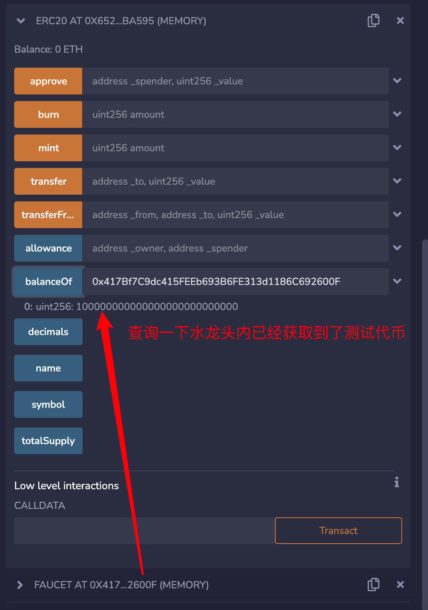

# solidity-app
application of solidity

## ERC20

学习完`ERC20`代币标准，便可以发行代币了。

`ERC20`是一项以太坊代币标准，是从EIP-20提案经过以太坊社区不断讨论验证后通过而来的，是由Vitalik Buterin于2015年提出，是以太坊的第20号代币标准。详细标准参考如下地址：

https://github.com/ethereum/EIPs/blob/master/EIPS/eip-20.md

代币规范，也就是接口。后续需要根据接口实现具体功能。接口的方法修改为external修饰符。

```solidity
// SPDX-License-Identifier: SEE LICENSE IN LICENSE
pragma solidity ^0.8.0;

interface IERC20 {
    
    /**
     * Returns the total token supply.
     * 返回总的代币数量
     */
    function totalSupply() external view returns (uint256);

    /**
     * Returns the account balance of another account with address _owner.
     * 返回某个账户的当前代币余额
     */
    function balanceOf(address _owner) external view returns (uint256 balance);

    /**
     * Transfers _value amount of tokens to address _to, and MUST fire the Transfer event. 
     * The function SHOULD throw if the message caller's account balance does not have enough tokens to spend.
     * 转账函数
     */
    function transfer(address _to, uint256 _value) external returns (bool success);

    /**
     * Transfers _value amount of tokens from address _from to address _to, and MUST fire the Transfer event.
     * The transferFrom method is used for a withdraw workflow, allowing contracts to transfer tokens on your behalf. 
     * This can be used for example to allow a contract to transfer tokens on your behalf and/or to charge fees in sub-currencies. 
     * The function SHOULD throw unless the _from account has deliberately authorized the sender of the message via some mechanism.
     * Note Transfers of 0 values MUST be treated as normal transfers and fire the Transfer event.
     * 授权转账
     */
    function transferFrom(address _from, address _to, uint256 _value) external returns (bool success);

    /**
     * Allows _spender to withdraw from your account multiple times, up to the _value amount. 
     * If this function is called again it overwrites the current allowance with _value.
     * 授权
     */
    function approve(address _spender, uint256 _value) external returns (bool success);

    /**
     * Returns the amount which _spender is still allowed to withdraw from _owner.
     * 返回_owner授权给_spender的额度
     */
    function allowance(address _owner, address _spender) external view returns (uint256 remaining);

    /**
     * MUST trigger when tokens are transferred, including zero value transfers.
     */
    event Transfer(address indexed _from, address indexed _to, uint256 _value);

    /**
     * MUST trigger on any successful call to approve(address _spender, uint256 _value).
     */
    event Approval(address indexed _owner, address indexed _spender, uint256 _value);
}
```

```solidity
// SPDX-License-Identifier: SEE LICENSE IN LICENSE
import "./IERC20.sol";
pragma solidity ^0.8.0;
contract ERC20 is IERC20 {

    //public类型的状态变量，会自动生成相对应的get方法；添加override表示生成的方法会重写继承自父合约与变量同名的函数,也可以自己自助生成相应的方法
    mapping (address => uint256) private balance;

    mapping (address => mapping (address => uint256)) private allow;

    //代币总量
    uint256 private total;
    //代币的名称
    string public name;
    //代币的代号
    string public symbol;

    uint8 public decimals = 18;

    address owner;

    function totalSupply() external override view returns (uint256){
        return total;
    }

    function balanceOf(address _owner) external override view returns (uint256){
        return balance[_owner];
    }

    function allowance(address _owner, address _spender) external override view returns (uint256){
        return allow[_owner][_spender];
    }


    constructor(string memory _name, string memory _symbol) {
        name = _name;
        symbol = _symbol;
        owner = msg.sender;
    }

    function transfer(address _to, uint256 _value) external override returns (bool){
        balance[msg.sender] -= _value;
        balance[_to]  += _value;
        emit Transfer(msg.sender, _to, _value);
        return true;
    }

    function approve(address _spender, uint256 _value) external override returns (bool success){
        allow[msg.sender][_spender]  = _value;
        emit Approval(msg.sender, _spender,  _value);
        return true;
    }

    function transferFrom(address _from, address _to, uint256 _value) external override returns (bool){
        allow[_from][msg.sender] -= _value;
        balance[_from] -= _value;
        balance[_to] += _value;
        emit Transfer(_from, _to, _value);
        return true;
    }

    function mint(uint amount) public{
        require(msg.sender == owner, "no permission");
        balance[msg.sender] += amount;
        total += amount;
        emit Transfer(address(0), msg.sender, amount);
    }

    function burn(uint amount) public{
        balance[msg.sender] -= amount;
        total -= amount;
        emit Transfer(msg.sender, address(0), amount);
    }
}
```


## Faucet

实现了一个简易的代币水龙头。用户每隔24h可以获取一次代币。

我们的业务逻辑如下：首先编写代币合约，发布代币。接下来在Faucet水龙头合约中，我们mint一定数量的代币。向外提供一个`acquireFaucet`的方法。EOA账号可以通过该方法每隔24h获取一次代币。

```solidity
// SPDX-License-Identifier: SEE LICENSE IN LICENSE
pragma solidity ^0.8.0;
import "./IERC20.sol";
import "./ERC20.sol";
contract Faucet {

    uint256 public allowedAmount = 100000000000000000000;

    address public tokenAddress;

    uint256 constant ONE_DAY = 86400;

    //记录每个地址领取代币的时间，后面可以设定每隔24h可以领取一次
    mapping (address => uint) acquiredAddress;

    //每当每个地址领取了一次代币，便触发当前事件
    event sendToken(address indexed _receiver, uint256 indexed _amount);

    constructor(address _tokenAddress) {
        tokenAddress = _tokenAddress;
        ERC20 token = ERC20(tokenAddress);
        token.mint(100000000000000000000000000);

    }


    function acquireFaucet() external {
        uint number = acquiredAddress[msg.sender];
        uint nowTime = block.timestamp;
        IERC20 token = IERC20(tokenAddress);
        require(token.balanceOf(address(this)) >= allowedAmount, "Faucet empty");
        if(number != 0){
            require(nowTime - number >= ONE_DAY, "Please try again after 24 hours from your original request.");
        }
        token.transfer(msg.sender, allowedAmount);
        acquiredAddress[msg.sender] = block.timestamp;
        emit sendToken(msg.sender, allowedAmount);
        //number为0，直接领取
    }
}
```





