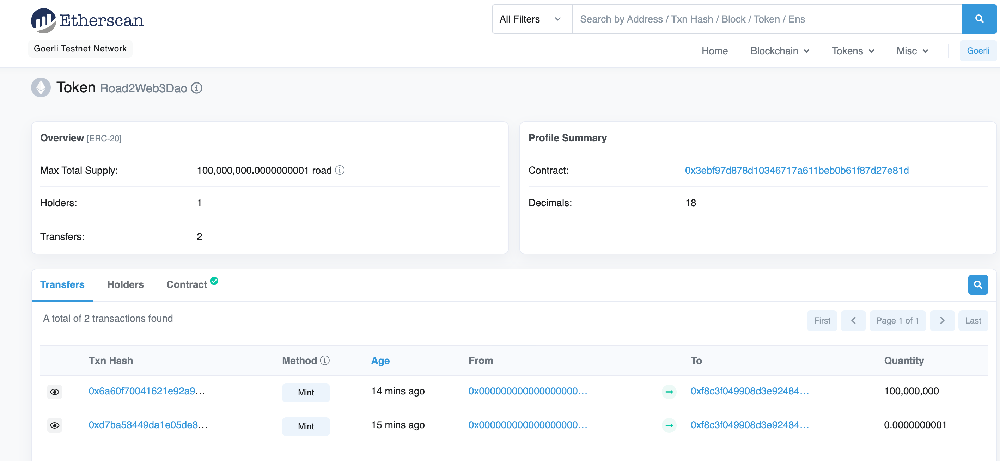

# solidity-app
application of solidity

## ERC20

学习完`ERC20`代币标准，便可以发行代币了。

`ERC20`是一项以太坊代币标准，是从EIP-20提案经过以太坊社区不断讨论验证后通过而来的，是由Vitalik Buterin于2015年提出，是以太坊的第20号代币标准。详细标准参考如下地址：

https://github.com/ethereum/EIPs/blob/master/EIPS/eip-20.md

代币规范，也就是接口。后续需要根据接口实现具体功能。接口的方法修改为external修饰符。

```solidity
// SPDX-License-Identifier: SEE LICENSE IN LICENSE
pragma solidity ^0.8.0;

interface IERC20 {
    
    /**
     * Returns the total token supply.
     * 返回总的代币数量
     */
    function totalSupply() external view returns (uint256);

    /**
     * Returns the account balance of another account with address _owner.
     * 返回某个账户的当前代币余额
     */
    function balanceOf(address _owner) external view returns (uint256 balance);

    /**
     * Transfers _value amount of tokens to address _to, and MUST fire the Transfer event. 
     * The function SHOULD throw if the message caller's account balance does not have enough tokens to spend.
     * 转账函数
     */
    function transfer(address _to, uint256 _value) external returns (bool success);

    /**
     * Transfers _value amount of tokens from address _from to address _to, and MUST fire the Transfer event.
     * The transferFrom method is used for a withdraw workflow, allowing contracts to transfer tokens on your behalf. 
     * This can be used for example to allow a contract to transfer tokens on your behalf and/or to charge fees in sub-currencies. 
     * The function SHOULD throw unless the _from account has deliberately authorized the sender of the message via some mechanism.
     * Note Transfers of 0 values MUST be treated as normal transfers and fire the Transfer event.
     * 授权转账
     */
    function transferFrom(address _from, address _to, uint256 _value) external returns (bool success);

    /**
     * Allows _spender to withdraw from your account multiple times, up to the _value amount. 
     * If this function is called again it overwrites the current allowance with _value.
     * 授权
     */
    function approve(address _spender, uint256 _value) external returns (bool success);

    /**
     * Returns the amount which _spender is still allowed to withdraw from _owner.
     * 返回_owner授权给_spender的额度
     */
    function allowance(address _owner, address _spender) external view returns (uint256 remaining);

    /**
     * MUST trigger when tokens are transferred, including zero value transfers.
     */
    event Transfer(address indexed _from, address indexed _to, uint256 _value);

    /**
     * MUST trigger on any successful call to approve(address _spender, uint256 _value).
     */
    event Approval(address indexed _owner, address indexed _spender, uint256 _value);
}
```

```solidity
// SPDX-License-Identifier: SEE LICENSE IN LICENSE
import "./IERC20.sol";
pragma solidity ^0.8.0;
contract ERC20 is IERC20 {

    //public类型的状态变量，会自动生成相对应的get方法；添加override表示生成的方法会重写继承自父合约与变量同名的函数,也可以自己自助生成相应的方法
    mapping (address => uint256) private balance;

    mapping (address => mapping (address => uint256)) private allow;

    //代币总量
    uint256 private total;
    //代币的名称
    string public name;
    //代币的代号
    string public symbol;

    uint8 public decimals = 18;

    address owner;

    function totalSupply() external override view returns (uint256){
        return total;
    }

    function balanceOf(address _owner) external override view returns (uint256){
        return balance[_owner];
    }

    function allowance(address _owner, address _spender) external override view returns (uint256){
        return allow[_owner][_spender];
    }


    constructor(string memory _name, string memory _symbol) {
        name = _name;
        symbol = _symbol;
        owner = msg.sender;
    }

    function transfer(address _to, uint256 _value) external override returns (bool){
        balance[msg.sender] -= _value;
        balance[_to]  += _value;
        emit Transfer(msg.sender, _to, _value);
        return true;
    }

    function approve(address _spender, uint256 _value) external override returns (bool success){
        allow[msg.sender][_spender]  = _value;
        emit Approval(msg.sender, _spender,  _value);
        return true;
    }

    function transferFrom(address _from, address _to, uint256 _value) external override returns (bool){
        allow[_from][msg.sender] -= _value;
        balance[_from] -= _value;
        balance[_to] += _value;
        emit Transfer(_from, _to, _value);
        return true;
    }

    function mint(uint amount) public{
        require(msg.sender == owner, "no permission");
        balance[msg.sender] += amount;
        total += amount;
        emit Transfer(address(0), msg.sender, amount);
    }

    function burn(uint amount) public{
        balance[msg.sender] -= amount;
        total -= amount;
        emit Transfer(msg.sender, address(0), amount);
    }
}
```



## Faucet

实现了一个简易的代币水龙头。用户每隔24h可以获取一次代币。

我们的业务逻辑如下：首先编写代币合约，发布代币。接下来在Faucet水龙头合约中，我们mint一定数量的代币。向外提供一个`acquireFaucet`的方法。EOA账号可以通过该方法每隔24h获取一次代币。

```solidity
// SPDX-License-Identifier: SEE LICENSE IN LICENSE
pragma solidity ^0.8.0;
import "./IERC20.sol";
import "./ERC20.sol";
contract Faucet {

    uint256 public allowedAmount = 100000000000000000000;

    address public tokenAddress;

    uint256 constant ONE_DAY = 86400;

    //记录每个地址领取代币的时间，后面可以设定每隔24h可以领取一次
    mapping (address => uint) acquiredAddress;

    //每当每个地址领取了一次代币，便触发当前事件
    event sendToken(address indexed _receiver, uint256 indexed _amount);

    constructor(address _tokenAddress) {
        tokenAddress = _tokenAddress;
        ERC20 token = ERC20(tokenAddress);
        token.mint(100000000000000000000000000);

    }


    function acquireFaucet() external {
        uint number = acquiredAddress[msg.sender];
        uint nowTime = block.timestamp;
        IERC20 token = IERC20(tokenAddress);
        require(token.balanceOf(address(this)) >= allowedAmount, "Faucet empty");
        if(number != 0){
            require(nowTime - number >= ONE_DAY, "Please try again after 24 hours from your original request.");
        }
        token.transfer(msg.sender, allowedAmount);
        acquiredAddress[msg.sender] = block.timestamp;
        emit sendToken(msg.sender, allowedAmount);
        //number为0，直接领取
    }
}
```


## Airdrop

空投。说白了就是白嫖。也是项目方用来进行营销的一种手段。项目方通过智能合约给EOA账号发放指定数量的代币。依然需要用到前面我们编写的ERC20和IERC20这两个合约。

```solidity
// SPDX-License-Identifier: SEE LICENSE IN LICENSE
pragma solidity ^0.8.0;
import "./IERC20.sol";
contract Airdrop {
    
    /**
     * _token表示代币合约地址
     * _airdropList表示需要空投的地址列表
     * _amounts表示一共需要空投代币的数量
     */
    function airdropTokens(address _token, address[] calldata _airdropList, uint256[] calldata _amounts) external{
        //地址列表和数量列表的长度应该相同
        require(_airdropList.length  == _amounts.length, "length of address do not equal with amounts");
        IERC20 token = IERC20(_token);
        uint amounts = checkSum(_amounts);
        //require(token.allowance(msg.sender, address(this)) >= amounts, "Approve ERC20 Token");
        for (uint i = 0; i < _airdropList.length; i++) {
            token.transferFrom(msg.sender, _airdropList[i], _amounts[i]);
        }
    }

    /**
     * 计算一共需要空投的代币总量
     */
    function checkSum(uint256[] calldata _amounts) internal pure returns (uint number){
        for (uint i = 0; i < _amounts.length; i++) {
            number += _amounts[i];
        }
    }
}
```


## ERC721

`BTC`以及`ETH`这类代币可以称之为同质化代币。因为挖出来的每一枚代币和其他代币没有什么不同，是同质化的。但是在实际生活中，很多物品却不是同质化的，比如艺术品等。因此以太坊社区提出了`ERC721`标准，用来抽象非同质化物品。

<a href='https://eips.ethereum.org/all'>EIP</a> 

`EIP`全称 `Ethereum Imporvement Proposals`(以太坊改进建议), 是以太坊开发者社区提出的改进建议。

`ERC`全称 Ethereum Request For Comment (以太坊意见征求稿), 用以记录以太坊上应用级的各种开发标准和协议。如`ERC20(Token Standard)`以及`ERC721(Non-Fungible Token Standard)`。

`EIP`包含`ERC`。

在介绍ERC之前，我们先梳理一下`type`的用法。

```solidity
// SPDX-License-Identifier: SEE LICENSE IN LICENSE
pragma solidity ^0.8.0;
import "./IERC165.sol";
contract TypeDemo {
    
    //type(整形).max/min可以返回最大/最小值
    function max() external pure returns (uint){
        return type(uint).max;
    }

    function mim() external pure returns (uint){
        return type(uint).min;
    }

    //type(Contract):name(合约名称)、creationCode(创建字节码)、runtimeCode(运行字节码)
    //type(Interface).interfaceId(获取一个接口的interfaceId 如果接口只有一个方法 则为方法的selector，否者为所有方法的selector的异或后结果)
    //下面使用了三种方式来获取interfaceId，结果均是一致的
    function typeId() external pure returns (bytes4 a, bytes4 b, bytes4 c){
        a = type(IERC165).interfaceId;
        b = bytes4(keccak256('supportsInterface(bytes4)'));
        c = IERC165.supportsInterface.selector;
    }
}
```


```solidity
// SPDX-License-Identifier: SEE LICENSE IN LICENSE
pragma solidity ^0.8.0;
interface IERC165 {
    
    /**
     * EIP-165:Standard Interface Detection.检验某个合约有没有实现该接口。如何校验呢？
     * The interface identifier for this interface is 0x01ffc9a7. You can calculate this by running bytes4(keccak256('supportsInterface(bytes4)'));
     * or using the Selector contract above.
     */
    function supportsInterface(bytes4 interfaceId) external view returns (bool);
}
```

```solidity
// SPDX-License-Identifier: SEE LICENSE IN LICENSE
pragma solidity ^0.8.0;
import "./IERC165.sol";
contract ERC165 is IERC165{

  /**
   * 0x01ffc9a7 ===
   *   bytes4(keccak256('supportsInterface(bytes4)'))
   */
    bytes4 private constant ERC165_InterfaceId = 0x01ffc9a7;

    mapping (bytes4 => bool) supportedInterfaces;

    constructor() {
        registerInterface(ERC165_InterfaceId);
    }

    function registerInterface(bytes4 _interfaceId) internal{
        require(_interfaceId != 0xffffffff);
        supportedInterfaces[_interfaceId] = true;
    }

    //特别注意：定长数组属于值类型，不属于引用类型，所以参数位置不需要添加memory
    function supportsInterface(bytes4 _interfaceId) external override view returns (bool){
        return supportedInterfaces[_interfaceId];
    }
}
```


```solidity
// SPDX-License-Identifier: SEE LICENSE IN LICENSE
pragma solidity ^0.8.0;
import "./IERC165.sol";
/**
 * @title ERC-721 Non-Fungible Token Standard
 * @dev see https://github.com/ethereum/EIPs/blob/master/EIPS/eip-721.md
 */
interface IERC721 is IERC165 {
    
    /// @dev This emits when ownership of any NFT changes by any mechanism.
    ///  This event emits when NFTs are created (`from` == 0) and destroyed
    ///  (`to` == 0). Exception: during contract creation, any number of NFTs
    ///  may be created and assigned without emitting Transfer. At the time of
    ///  any transfer, the approved address for that NFT (if any) is reset to none.
    /// 转账事件，转出地址from，转入地址to，以及tokenId
    event Transfer(address indexed from, address indexed to, uint256 indexed tokenId);

    /// @dev This emits when the approved address for an NFT is changed or
    ///  reaffirmed. The zero address indicates there is no approved address.
    ///  When a Transfer event emits, this also indicates that the approved
    ///  address for that NFT (if any) is reset to none.
    ///  授权事件，记录授权地址owner，被授权地址approved和tokenid
    event Approval(address indexed owner, address indexed approved, uint256 indexed tokenId);

    /// @dev This emits when an operator is enabled or disabled for an owner.
    ///  The operator can manage all NFTs of the owner.
    ///  批量授权事件，记录批量授权的发出地址owner，被授权地址operator和授权与否的approved
    event ApprovalForAll(address indexed owner, address indexed operator, bool approved);

    /// @notice Count all NFTs assigned to an owner
    /// @dev NFTs assigned to the zero address are considered invalid, and this
    ///  function throws for queries about the zero address.
    /// @param owner An address for whom to query the balance
    /// @return balance The number of NFTs owned by `_owner`, possibly zero
    /// 返回某个地址所拥有的所有的NFT数量
    function balanceOf(address owner) external view returns (uint256 balance);

    /// @notice Find the owner of an NFT
    /// @dev NFTs assigned to zero address are considered invalid, and queries
    ///  about them do throw.
    /// @param tokenId The identifier for an NFT
    /// @return owner The address of the owner of the NFT
    /// 返回某个tokenId所属的主人地址
    function ownerOf(uint256 tokenId) external view returns (address owner);

    /// @notice Transfers the ownership of an NFT from one address to another address
    /// @dev Throws unless `msg.sender` is the current owner, an authorized
    ///  operator, or the approved address for this NFT. Throws if `_from` is
    ///  not the current owner. Throws if `_to` is the zero address. Throws if
    ///  `_tokenId` is not a valid NFT. When transfer is complete, this function
    ///  checks if `_to` is a smart contract (code size > 0). If so, it calls
    ///  `onERC721Received` on `_to` and throws if the return value is not
    ///  `bytes4(keccak256("onERC721Received(address,address,uint256,bytes)"))`.
    /// @param from The current owner of the NFT
    /// @param to The new owner
    /// @param tokenId The NFT to transfer
    /// @param data Additional data with no specified format, sent in call to `_to`
    /// 安全转账（如果接收方是合约地址，会要求实现ERC721Receiver接口）。参数为转出地址from，接收地址to和tokenId
    function safeTransferFrom(
        address from,
        address to,
        uint256 tokenId,
        bytes memory data
    ) external;

    /// @notice Transfers the ownership of an NFT from one address to another address
    /// @dev This works identically to the other function with an extra data parameter,
    ///  except this function just sets data to "".
    /// @param from The current owner of the NFT
    /// @param to The new owner
    /// @param tokenId The NFT to transfer
    function safeTransferFrom(
        address from,
        address to,
        uint256 tokenId
    ) external;

    /// @notice Transfer ownership of an NFT -- THE CALLER IS RESPONSIBLE
    ///  TO CONFIRM THAT `_to` IS CAPABLE OF RECEIVING NFTS OR ELSE
    ///  THEY MAY BE PERMANENTLY LOST
    /// @dev Throws unless `msg.sender` is the current owner, an authorized
    ///  operator, or the approved address for this NFT. Throws if `_from` is
    ///  not the current owner. Throws if `_to` is the zero address. Throws if
    ///  `_tokenId` is not a valid NFT.
    /// @param from The current owner of the NFT
    /// @param to The new owner
    /// @param tokenId The NFT to transfer
    function transferFrom(
        address from,
        address to,
        uint256 tokenId
    ) external;

    /// @notice Change or reaffirm the approved address for an NFT
    /// @dev The zero address indicates there is no approved address.
    ///  Throws unless `msg.sender` is the current NFT owner, or an authorized
    ///  operator of the current owner.
    /// @param to The new approved NFT controller
    /// @param tokenId The NFT to approve
    /// 授权另一个地址使用你的NFT。参数为被授权地址approve和tokenId
    function approve(address to, uint256 tokenId) external;

    /// @notice Enable or disable approval for a third party ("operator") to manage
    ///  all of `msg.sender`'s assets
    /// @dev Emits the ApprovalForAll event. The contract MUST allow
    ///  multiple operators per owner.
    /// @param operator Address to add to the set of authorized operators
    /// @param _approved True if the operator is approved, false to revoke approval
    /// 将自己持有的该系列NFT批量授权给某个地址operator
    function setApprovalForAll(address operator, bool _approved) external;

    /// @param tokenId The NFT to find the approved address for
    /// @return operator The approved address for this NFT, or the zero address if there is none
    /// 查询tokenId被批准给了哪个地址
    function getApproved(uint256 tokenId) external view returns (address operator);

    /// @notice Query if an address is an authorized operator for another address
    /// @param owner The address that owns the NFTs
    /// @param operator The address that acts on behalf of the owner
    /// @return True if `_operator` is an approved operator for `_owner`, false otherwise
    /// 查询某地址的NFT是否批量授权给了另一个operator地址
    function isApprovedForAll(address owner, address operator) external view returns (bool);
}
```

```solidity
// SPDX-License-Identifier: SEE LICENSE IN LICENSE
pragma solidity ^0.8.0;
/**
 * @title ERC721 token receiver interface
 * @dev Interface for any contract that wants to support safeTransfers
 * from ERC721 asset contracts.
 * 如果进行NFT转账时，接收方是一个合约地址，那么必须要实现IERC721Receiver接口，具有onERC721Received方法，否则NFT直接被打入黑洞
 */
interface IERC721Receiver {
    
  /**
   * @notice Handle the receipt of an NFT
   * @dev The ERC721 smart contract calls this function on the recipient
   * after a `safeTransfer`. This function MUST return the function selector,
   * otherwise the caller will revert the transaction. The selector to be
   * returned can be obtained as `this.onERC721Received.selector`. This
   * function MAY throw to revert and reject the transfer.
   * Note: the ERC721 contract address is always the message sender.
   * @param operator The address which called `safeTransferFrom` function
   * @param from The address which previously owned the token
   * @param tokenId The NFT identifier which is being transferred
   * @param data Additional data with no specified format
   * @return `bytes4(keccak256("onERC721Received(address,address,uint256,bytes)"))`
   */
    function onERC721Received(
        address operator,
        address from,
        uint tokenId,
        bytes calldata data
    ) external returns (bytes4);
}
```

```solidity
// SPDX-License-Identifier: SEE LICENSE IN LICENSE
pragma solidity ^0.8.0;
import "./ERC165.sol";
import "./IERC721.sol";
import "./IERC721Metadata.sol";
import "./IERC721Receiver.sol";
import "./Address.sol";

contract ERC721 is ERC165, IERC721 {

    using Address for address;

  // Equals to `bytes4(keccak256("onERC721Received(address,address,uint256,bytes)"))`
  // which can be also obtained as `IERC721Receiver(0).onERC721Received.selector`
  bytes4 private constant ERC721_RECEIVED = 0x150b7a02;

/*
   * 0x80ac58cd ===
   *   bytes4(keccak256('balanceOf(address)')) ^
   *   bytes4(keccak256('ownerOf(uint256)')) ^
   *   bytes4(keccak256('approve(address,uint256)')) ^
   *   bytes4(keccak256('getApproved(uint256)')) ^
   *   bytes4(keccak256('setApprovalForAll(address,bool)')) ^
   *   bytes4(keccak256('isApprovedForAll(address,address)')) ^
   *   bytes4(keccak256('transferFrom(address,address,uint256)')) ^
   *   bytes4(keccak256('safeTransferFrom(address,address,uint256)')) ^
   *   bytes4(keccak256('safeTransferFrom(address,address,uint256,bytes)'))
   */
  bytes4 private constant ERC721_InterfaceId = 0x80ac58cd;

    constructor(){
        registerInterface(ERC721_InterfaceId);
    }
    //地址和该地址的NFT数量的映射关系
    mapping (address => uint) balances;
    //tokenId和所属地址之间的映射关系
    mapping (uint => address) owners;

    //某tokenId和授权地址的映射关系(每个token在同一时间只可以授权给一个地址)
    mapping (uint => address) tokenApprovals;
    //将owner地址授权给operator的映射关系
    mapping (address => mapping (address => bool)) operatorApprovals;

    //返回某个地址拥有的NFT的数量
    function balanceOf(address _owner) external view override returns (uint256 balance){
        require(_owner != address(0), "black hole address");
        balance = balances[_owner];
    }

    //返回某个tokenId所属的地址
    function ownerOf(uint256 _tokenId) public view override returns (address owner){
        owner = owners[_tokenId];
        require(owner != address(0), "token is in the black hole");
    }
  /**
   * @dev Safely transfers the ownership of a given token ID to another address
   * If the target address is a contract, it must implement `onERC721Received`,
   * which is called upon a safe transfer, and return the magic value
   * `bytes4(keccak256("onERC721Received(address,address,uint256,bytes)"))`; otherwise,
   * the transfer is reverted.
   * Requires the msg sender to be the owner, approved, or operator
   * @param _from current owner of the token
   * @param _to address to receive the ownership of the given token ID
   * @param _tokenId uint256 ID of the token to be transferred
   * @param _data bytes data to send along with a safe transfer check
   * 安全的转账，为了保证接收地址如果是合约，如果没有实现onERC721Received会出错
   */
    function safeTransferFrom(address _from,address _to,uint256 _tokenId,bytes memory _data) public override{
        transferFrom(_from, _to, _tokenId);
        require(_checkERC721Received(_from, _to, _tokenId, _data));
    }

    //如果是合约，则必须实现该接口，否则NFT发送到该合约便消失了
    function _checkERC721Received(address _from,address _to,uint256 _tokenId,bytes memory _data)internal returns (bool){
        if(!_to.isContract()){
            return true;
        }
        bytes4 code = IERC721Receiver(_to).onERC721Received(msg.sender, _from, _tokenId, _data);
        return code == ERC721_RECEIVED;
    }

 
    function safeTransferFrom(address _from,address _to,uint256 _tokenId) external override{
        safeTransferFrom(_from, _to, _tokenId, "");
    }

  /**
   * @dev Transfers the ownership of a given token ID to another address
   * Usage of this method is discouraged, use `safeTransferFrom` whenever possible
   * Requires the msg sender to be the owner, approved, or operator
   * @param _from current owner of the token
   * @param _to address to receive the ownership of the given token ID
   * @param _tokenId uint256 ID of the token to be transferred
  */
    function transferFrom(address _from, address _to, uint256 _tokenId) public override{
        require(_isApprovedOrOwner(msg.sender, _tokenId));
        require(_to != address(0));
        //清除授权
        _clearApproval(_from, _tokenId);
        _removeTokenFrom(_from, _tokenId);
        _addTokenTo(_to, _tokenId);
        emit Transfer(_from, _to, _tokenId);
    }

    function _addTokenTo(address _to, uint _tokenId)internal {
        require(owners[_tokenId] == address(0));
        balances[_to] += 1;
        owners[_tokenId] = _to;
    }

    function _removeTokenFrom(address _from, uint _tokenId)internal {
        require(ownerOf(_tokenId) == _from);
        balances[_from] -= 1;
        owners[_tokenId] = address(0);
    }

    //清除授权信息
    function _clearApproval(address _owner, uint _tokenId) internal {
        require(ownerOf(_tokenId) == _owner);
        tokenApprovals[_tokenId] = address(0);
    }

    //是否是授权地址或者是拥有者
    function _isApprovedOrOwner(address _caller, uint _tokenId) internal view returns (bool){
        address owner = ownerOf(_tokenId);
        //三种情况：1.拥有者 2.当前tokenId授权给了该地址 3.将当前地址下的所有NFT全部授权给了该地址
        return (_caller == owner || getApproved(_tokenId) == _caller || isApprovedForAll(owner, _caller));
    }


    /**
   * @dev Approves another address to transfer the given token ID
   * The zero address indicates there is no approved address.
   * There can only be one approved address per token at a given time.
   * Can only be called by the token owner or an approved operator.
   * @param _to address to be approved for the given token ID
   * @param _tokenId uint256 ID of the token to be approved
   * 将tokenId授权给to地址；
   */
    function approve(address _to, uint256 _tokenId) external override{
        //获取当前tokenId的拥有者
        address owner = ownerOf(_tokenId);
        //不要自己给自己发送
        require(owner != _to);
        //仅当前tokenId拥有者或者授权的合约地址可以调用该方法;isApprovedForAll查询owner地址的NFT是否批量授权给msg.sender调用者
        require(msg.sender == owner || isApprovedForAll(owner, msg.sender));
        //将_tokenId授权给_to地址
        tokenApprovals[_tokenId] = _to;
        emit Approval(owner, _to, _tokenId);
    }

  /**
   * @dev Sets or unsets the approval of a given operator
   * An operator is allowed to transfer all tokens of the sender on their behalf
   * @param _operator operator address to set the approval
   * @param _approved representing the status of the approval to be set
   * 将全部代币授权给operator地址或者撤销授权
   */
    function setApprovalForAll(address _operator, bool _approved) external override{
        require(_operator != msg.sender);
        operatorApprovals[msg.sender][_operator] = _approved;
        emit ApprovalForAll(msg.sender, _operator, _approved);
    }

  /**
   * @dev Gets the approved address for a token ID, or zero if no address set
   * Reverts if the token ID does not exist.
   * @param _tokenId uint256 ID of the token to query the approval of
   * @return operator currently approved for the given token ID
   * 查询当前tokenId的授权地址
   */
    function getApproved(uint256 _tokenId) public override view returns (address operator){
        require(_exists(_tokenId));
        operator = tokenApprovals[_tokenId];
    }

    /**
   * @dev Returns whether the specified token exists
   * @param _tokenId uint256 ID of the token to query the existence of
   * @return whether the token exists
   */
  function _exists(uint256 _tokenId) internal view returns (bool) {
    address owner = owners[_tokenId];
    return owner != address(0);
  }

  /**
   * @dev Tells whether an operator is approved by a given owner
   * @param _owner owner address which you want to query the approval of
   * @param _operator operator address which you want to query the approval of
   * @return bool whether the given operator is approved by the given owner
   */
    function isApprovedForAll(address _owner, address _operator) public override view returns (bool){
        return operatorApprovals[_owner][_operator];
    }

    /**
   * @dev Internal function to mint a new token
   * Reverts if the given token ID already exists
   * @param _to The address that will own the minted token
   * @param _tokenId uint256 ID of the token to be minted by the msg.sender
   */
  function _mint(address _to, uint256 _tokenId) internal {
    require(_to != address(0));
    _addTokenTo(_to, _tokenId);
    emit Transfer(address(0), _to, _tokenId);
  }

  /**
   * @dev Internal function to burn a specific token
   * Reverts if the token does not exist
   * @param _tokenId uint256 ID of the token being burned by the msg.sender
   */
  function _burn(uint256 _tokenId) internal {
    address owner = ownerOf(_tokenId);
    require(msg.sender == owner, "you can not burn someone else's token");
    _clearApproval(owner, _tokenId);
    _removeTokenFrom(owner, _tokenId);
    emit Transfer(owner, address(0), _tokenId);
  }
}
```

```solidity
// SPDX-License-Identifier: SEE LICENSE IN LICENSE
pragma solidity ^0.8.0;
import "./IERC721.sol";
/**
 * @title ERC-721 Non-Fungible Token Standard, optional metadata extension
 * @dev See https://github.com/ethereum/EIPs/blob/master/EIPS/eip-721.md
 */
interface IERC721Metadata is IERC721 {
    
    //返回代币名称
    function name() external view returns (string memory);

    //返回代币代号
    function symbol() external view returns (string memory);

    //通过tokenId查询链接url
    function tokenURI(uint256 tokenId) external view returns (string memory);
}
```

```solidity
// SPDX-License-Identifier: SEE LICENSE IN LICENSE
pragma solidity ^0.8.0;
import "./ERC165.sol";
import "./ERC721.sol";
import "./IERC721Metadata.sol";
import "./Strings.sol";

contract ERC721Metadata is ERC165, ERC721, IERC721Metadata{

    string internal tokenName;

    string internal tokenSymbol;

    using Strings for uint256;

  /**
   * 0x5b5e139f ===
   *   bytes4(keccak256('name()')) ^
   *   bytes4(keccak256('symbol()')) ^
   *   bytes4(keccak256('tokenURI(uint256)'))
   */
    bytes4 private constant ERC721Metadata_InterfaceId = 0x5b5e139f;

    constructor(string memory _name, string memory _symbol) {
        tokenName = _name;
        tokenSymbol = _symbol;
        registerInterface(ERC721Metadata_InterfaceId);
    }

    function name() external override view returns (string memory){
        return tokenName;
    }

    function symbol() external override view returns (string memory){
        return tokenSymbol;
    }

    function tokenURI(uint256 tokenId) external override view returns (string memory){
        require(_exists(tokenId));
        string memory baseURI = _baseURI();
        return bytes(baseURI).length > 0 ? string(abi.encodePacked(baseURI, tokenId.toString())) : "";
    }

    //定义一个方法，发行ERC721代币，需要继承当前合约，并且实现该方法
    function _baseURI() internal view virtual returns (string memory){
        return "";
    }
}
```

```solidity
// SPDX-License-Identifier: SEE LICENSE IN LICENSE
pragma solidity ^0.8.0;
import "./ERC721Metadata.sol";
import "./SafeMath.sol";

contract Road2Web3 is ERC721Metadata{

    uint public MAX_SUPPLY = 1000;

    using SafeMath for uint256;

    uint private index = 1;

    constructor(string memory _name, string memory _symbol) ERC721Metadata(_name, _symbol) {
        
    }

    //设置ipfs
     function _baseURI() internal pure override returns (string memory){
        return "ipfs://QmeDEvsWpBk429UJj9JTrgtHZpNJksvPVK4GfQv439UpXW/";
    }

    function mint() external{
        require(index <= MAX_SUPPLY, "All items have been minted");
        _mint(msg.sender, index);
    }
}
```

除此之外还需要一些工具类，就不展示了。

## 荷兰拍卖

荷兰拍卖这种拍卖方式较为独特，采用降价的形式进行。指的是竞价标的物从高到低依次递减的方式，直至第一个竞价人应价时成交的一种拍卖。

因为荷兰拍卖持续的时间比较久，这样就可以避免`gas`的激增。

```solidity
// SPDX-License-Identifier: SEE LICENSE IN LICENSE
pragma solidity ^0.8.0;
import "../erc721/Road2Web3.sol";
import "@openzeppelin/contracts/access/Ownable.sol";

contract DutchAuction is Ownable, Road2Web3("Road2Web3", "r2w3"){
    //NFT总数量
    uint256 public constant COLLECTION_SIZE = 1000;
    //竞拍开始价格
    uint256 public constant AUCTION_START_PRICE = 1 ether;
    //竞拍地板价格
    uint256 public constant AUCTION_FLOOR_PRICE = 0.1 ether;
    //竞拍持续时间
    uint256 public constant AUCTION_DURATION_TIME = 10 minutes;
    //无人竞拍时，多久衰减一次价格
    uint256 public constant AUCTION_DECLINE_INTERVAL = 1 minutes;
    //价格衰减率
    uint256 public constant AUCTION_DECLINE_RATE = (AUCTION_START_PRICE - AUCTION_FLOOR_PRICE) / (AUCTION_DURATION_TIME / AUCTION_DECLINE_INTERVAL);

    uint256 public auctionStartTime;

    uint256 private baseTokenURI;

    constructor(){
        auctionStartTime = block.timestamp;
    }

    //只有合约的部署者才可以mint No.1号NFT，后续要进行拍卖
    function mintGenesisNFT() external onlyOwner {
        uint mintIndex = totalSupply() + 1;
        _mint(msg.sender, mintIndex);
        _addTokenIndex(mintIndex);
    }

    //项目方开始拍卖前需要调用该方法
    function setAuctionStartTime(uint256 _timestamp) external onlyOwner {
        auctionStartTime = _timestamp;
    }

    /**
     * block.timestamp < auctionTime,还未开始拍卖-----开始价格
     * block.timestamp - auctionTime > duration_time, 拍卖已经结束-----地板价
     */
    function getAuctionPrice() public view returns (uint){
        if(block.timestamp < auctionStartTime){
            return AUCTION_START_PRICE;
        }else if((block.timestamp - auctionStartTime) >= AUCTION_DURATION_TIME){
            return AUCTION_FLOOR_PRICE;
        }else {
            //衰减了多少次
            uint numberOfDecline = (block.timestamp - auctionStartTime) / AUCTION_DECLINE_INTERVAL;
            return AUCTION_START_PRICE - (AUCTION_DECLINE_RATE * numberOfDecline);
        }
    }
    

    function auctionAndMint(uint number)external payable{
        //建立局部变量，减少gas费
        uint _startTime = auctionStartTime;
        require(_startTime != 0 && block.timestamp >= _startTime, "Sale have not been started");
        require(totalSupply() + number <= COLLECTION_SIZE, "All items have benn minted");
        uint totalCost = getAuctionPrice() * number;
        require(msg.value >= totalCost, "Not enough ETH to mint");
        payable(msg.sender).transfer(msg.value - totalCost);
        for (uint i = 0; i < number; i++) {
            uint mintIndex = totalSupply() + 1;
            _mint(msg.sender, mintIndex);
            _addTokenIndex(mintIndex);
        }

    }

    //提取所有的eth主币
    function withdraw() external onlyOwner{
        (bool success, ) = msg.sender.call{value: address(this).balance}("");
        require(success, "withdraw failed");
    }

    fallback() external payable{}

    receive() external payable{}
}
```

## 英式拍卖

英式拍卖就是我们平时经常见到的拍卖形式。在拍卖期间，最高价者竞拍得到标的物品。英式拍卖通常对某单个标的物品进行拍卖。比如NFT发售等场景，一般不会采取这种方式。但是比如`1`编号的某个NFT可能会进行拍卖。那么便可以使用这种方式。比如下面案例我们就实现了使用荷兰拍卖NFT藏品，但是针对特殊的No.1号藏品，我们采取的是项目方先mint之后，采取英式拍卖的方式来进行拍卖。整体业务逻辑较为复杂，需要涉及到多个账号。


```solidity
// SPDX-License-Identifier: SEE LICENSE IN LICENSE
pragma solidity ^0.8.0;
import "../erc721/Road2Web3.sol";
import "@openzeppelin/contracts/access/Ownable.sol";
//采用英式拍卖拍卖NFT中的第1号藏品
//设定拍卖时间为12h，由最高竞拍者获得
//竞拍时需要将主币转移到合约中，如果目前出价最高，则拍下不允许撤销拍卖
//如果有其他人出更高价格，那么当前竞拍者可以提取出代币，再次进行竞拍；或者直接放弃等等......
contract EnglishAuction is Ownable{
    
    //要拍卖的是哪个NFT
    Road2Web3 public nftAddress;
    //NFT中的几号藏品
    uint public tokenId;

    //出售方，可以是个人，也可以是项目方，也就是拥有上述tokenId的账户
    address public seller;

    uint public auctionStartTime;

    uint public constant AUCTION_DURATION_TIME = 5 minutes;

    //最高报价
    uint public highestBid;

    //最高报价的出价人
    address public highestBidder;

    //不是最高竞价的竞拍者和竞拍价格的映射
    mapping (address => uint) public withdraw;

    constructor(uint _tokenId, address _nftAddress){
        tokenId = _tokenId;
        nftAddress = Road2Web3(_nftAddress);
    }

    //卖家授权挂牌拍卖
    function listToSell() external{
        require(nftAddress.ownerOf(tokenId) == msg.sender, "you don't the item");
        seller = msg.sender;
        //(bool result, ) = address(nftAddress).delegatecall(abi.encodeWithSignature("approve(address,uint256)", address(this), tokenId));
        //nftAddress.approve(address(this), tokenId);
        //require(result, "approve failed");
    }

    function setAuctionStartTime(uint _timestamp) external onlyOwner{
        auctionStartTime = _timestamp;
    }

    function bid() external payable{
        require(block.timestamp >= auctionStartTime, "auction has not started");
        require((auctionStartTime + AUCTION_DURATION_TIME) > block.timestamp, "auction has ended");
        require(msg.value > highestBid, "you must bid higger");
        if(highestBid != 0){
            //如果有新的竞拍者出了更高的价格，那么之前的竞拍者就不是最高出价了，它可以选择退出拍卖，拿回现金；或者继续追加
            withdraw[highestBidder] += highestBid;
        }
        highestBid = msg.value;
        highestBidder = msg.sender;
    }
    //竞拍失败的竞拍者可以随时取出竞拍金
    function withdrawMoney() external {
        uint balance = withdraw[msg.sender];
        require(balance != 0, "you can not withdraw");
        withdraw[msg.sender] = 0;
        payable(msg.sender).transfer(balance);
    }
    //竞拍成功的竞拍者可以mint No.1 NFT
    function claim() external{
        require(msg.sender == highestBidder, "only highest bidder can mint");
        nftAddress.safeTransferFrom(seller, highestBidder, tokenId);
    }
}
```

## Merkle Tree

`Merkle Tree`是区块链底层大量使用的一种技术。`Merkle Tree`最主要的功能是可以对大量的数据进行有效、安全、高效的验证。比如可以在区块链中对于交易来进行验证。在我们开发过程中，我们可以利用`Merkle Tree`来进行白名单验证等。比如`Aptos`发放空投等，验证某个地址是否在空投白名单中。还比如最近因为`FTX`暴雷而导致的`CEX`信任危机。`CEX`提出的资产证明方案。同时附上<a href='https://vitalik.ca/index.html'>Vitalik Buterin's website</a>


上图是`Merkle Tree`的结构。相邻两个节点进行`hash`运算之后的`hash`值，再两两进行运算，最终会得到一个`ROOT hash`值。

`Merkle Tree`可以允许对大型数据结构的内容进行有效以及安全的验证(`Merkle Proof`)。比如图中绿色标注的`Charlie`，如果想验证该节点是否在`Merkle Tree`中，那么它的`Merkle Proof`为`hash(David)`、`hash(L,R) 70ETH`、`hash(L,R) 1236ETH`。为什么呢？因为对`Charlie`和`David`进行`hash`值运算之后，会得到`hash(L2,R2) 174ETH`，而它与`hash(L,R) 70ETH`再次进行运算会得到`hash(L,R) 244ETH`。该值和最后`hash(L,R) 1236ETH`运算之后便会得到`ROOT hash`值。通过比对给定的`ROOT hash`值和计算得到的`ROOT hash`值比对，这样便可以确认该节点是否在`Merkle Tree`中了。


如上图所示，如果我希望验证蓝色标注的地址是否在白名单中，那么我们可以使用`Merkle Tree`来维护白名单。我们验证时`Proof`只需要绿色标注的部分即可。	

**如何生成Merkle Tree，可以参考如下两个地址：**

<a href='https://lab.miguelmota.com/merkletreejs/example/'>网页页面</a>

<a href='https://github.com/merkletreejs/merkletreejs'>Github-MerkleTreeJS</a>

```solidity
// SPDX-License-Identifier: SEE LICENSE IN LICENSE
pragma solidity ^0.8.7;
library MerkleTreeProof {
    
    /**
     * 利用leaf节点和给定的proof，推算出一个root值，如果和给定的root值相等，则说明leaf在Merkle Tree中
     */
    function verify(bytes32[] calldata proof, bytes32 root, bytes32 leaf) public pure returns(bool){
        return _proofProcedure(proof, leaf) == root;
    }

    function _proofProcedure(bytes32[] calldata _proof, bytes32 _leaf) internal pure returns(bytes32){
        bytes32 computedHash = _leaf;
        for (uint i = 0; i < _proof.length; i++) {
            computedHash = _combineHash(computedHash, _proof[i]);
        }
        return computedHash;
    }

    /**
     * 排序之后进行hash运算，保障无论顺序如何得到的hash值永远是相同的
     */
    function _combineHash(bytes32 _b1, bytes32 _b2) internal pure returns(bytes32){
        return _b1 < _b2 ? keccak256(abi.encodePacked(_b1, _b2)) : keccak256(abi.encodePacked(_b2, _b1));
    }
}
```

```solidity
// SPDX-License-Identifier: MIT
pragma solidity ^0.8.7;
import "../erc721/Road2Web3.sol";
import "./MerkleTreeProof.sol";
/**
 * 利用白名单来mint，如果用户很多，怎么验证某个用户是否在白名单中。挨个遍历太浪费gas。可以使用Merkle Proof
 */
contract WhiteList is Road2Web3("Road2Web3Dao", "r2w3"){
    //记录Merkle Tree Root
    bytes32 immutable public merkleRoot;
    //是否已经mint过的地址
    mapping (address => bool) public mintedAddress;

    uint public tokenId;

    constructor(bytes32 _merkleRoot){
        merkleRoot = _merkleRoot;
    }

    function mint(bytes32[] calldata  _proof) external{
        require(mintedAddress[msg.sender] == false, "current address already minted");
        require(_verify(_leafHash(msg.sender), _proof), "invalid merkle proof");
        tokenId ++;
        mint(tokenId);
    }

    //这种方法也可以将address类型转换成了bytes类型
    function _leafHash(address _account) internal pure returns (bytes32){
        return keccak256(abi.encodePacked(_account));
    }

    function _verify(bytes32 _leaf, bytes32[] calldata _proof) internal view returns (bool){
        return MerkleTreeProof.verify(_proof, merkleRoot, _leaf);
    }   
}
```

